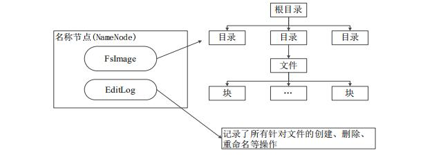

## 
 HDFS原理
**1.简介** 
&emsp;&emsp;当数据集的大小超过一台独立的物理计算机的存储能力时，就有必要对它进行分区（Partition）并存储到若干台单独的计算机上。管理网络中跨多台计算机存储的文件系统称为**分布式文件系统**（distributed file system），分布式的文件系统是基于网络的，势必会引入网络编程的复杂性，因此分布式文件系统比普通的文件系统更为复杂。**HDFS**（Hadoop Distributed File System）是一种分布式文件系统，HDFS有高容错性的特点，并且设计用来部署在低廉的硬件上；而且它提供高吞吐量（high throughput）来访问应用程序的数据，适合那些有着超大数据集的应用程序。
- 设计目标：
  - **兼容廉价的硬件设备**：不需要运行在昂贵且高可靠的硬件之上，所以可以降低企业构建集群的成本；但是同时也产生另外一个问题，对于庞大的集群来说节点的故障率相对来说会比较高，为此，HDFS也提供相应的解决方案。
  - **将硬件故障当作常态而不是异常**：错误检测和快速、自动的恢复是HDFS最核心的架构目标。
  - **超大数据集**：支持大规模海量数据存储，从GB级支持到EB级，支持集群的线性水平可扩展性。
  - **流式数据访问**：HDFS的构建思路是这样的：一次写入、多次读取时最有效的访问模式。数据通常从数据源中收集而来，然后在该数据集上可以进行长时间的数据处理、分析，每次分析都会涉及到整个数据集的全部或者大部分数据（例如，构建倒排索引、数据的统计分析、数据挖掘等等），所以相对于读取一条数据的延迟时间，读取整个数据集的延迟时间更为重要。
  - **跨平台兼容性**：由于是基于java语言的，所以HDFS天生就具有跨平台性。
- HDFS的特点：
    - 突出点：
      - 高容错性
      - 高吞吐量
      - 适用于大文件存储
      - 适用于流式文件数据访问
      - 故障检测和自动恢复
      - 低成本——基于普通硬件集群构建
    - 局限性：
      - **不适合低延迟的数据访问**：要求低延迟的应用（例如几十毫秒范围之内）不适合构建于HDFS之上。HDFS更注重的是吞吐量，所以也就以提高时间延迟为代价。对于低延迟要求的应用，Hbase（后期会继续介绍）是一种更好的选择。
      - **无法高效存储大量的小文件**：由于namenode将文件系统的元数据存储在内存中，因此该文件系统所能存储的文件总数受限于namenode内存的大小。根据经验，每个文件、目录和数据块大约占150Byte。因此，如果有一百万个文件，每个文件占据一个数据块的话，至少需要300MB内存，当文件数量达到数十亿的时候，内存将难以得到满足。
      - **不支持多用户写入和任意修改文件**：HDFS中的文件只能有一个Writer，而且写操作总是将数据添加在文件的末尾。不支持具有多个用户的写入，也不支持文件任意位置的修改。可能之后的版本会支持这些操作，但是效率肯定不会太高。
- 应用场景：海量数据（视频、网页）的可靠性存储、数据归档（视频监控领域）

**2.基本概念**
- 数据块（block）
  - 概念：每个磁盘都有默认的数据块大小，这是磁盘读写数据的最小单位。但是，文件系统的数据块与磁盘的不太一样，构建于单个磁盘之上的文件系统通过磁盘块来管理文件系统的块，该文件系统的块大小可以是磁盘块大小的整数倍，文件系统块一般为几千字节（ext3、4的大小默认是4kb），而磁盘块的大小一般为512字节。HDFS的块大小要大得多，1.x默认是64MB，2.x默认是128MB，与单一磁盘上的文件系统类似，HDFS上的文件也被分为多个块（chunk），作为独立的存储单元。与其它文件系统不同的是，HDFS中小于一个块的文件不会占据整个块的空间。
  - 分块存储的好处：
    - **支持大规模文件存储**：文件以块为单位进行存储，一个大规模文件可以被分拆成若干个文件块，不同的文件块可以被分发到不同的节点上，因此，一个文件的大小不会受到单个节点的存储容量的限制，可以远远大于网络中任意节点的存储容量。即一个文件的大小可以大于网络中任意一个磁盘的容量。
    - **简化系统设计**：首先，大大简化了存储管理，因为文件块大小是固定的，这样就可以很容易计算出一个节点可以存储多少文件块；其次，方便了元数据的管理，元数据不需要和文件块一起存储，可以由其他系统负责管理元数据。
    - **适合数据备份**：每个文件块都可以冗余存储到多个节点上，大大提高了系统的容错性和可用性。试想，如果不采用分块的思想的话，当一个文件的大小大于单个磁盘大小时将无法进行冗余存储。
  - 块大小的问题：
    - 为何相对于普通磁盘块大小要大这么多？
      - HDFS的块比磁盘的块大，其目的是为了最小化寻址开销。假设，磁盘寻址时间为10ms，而传输速率为100MB/s，为了使寻址时间只占据传输时间的1%，我们就需要将块大小设置为100MB。
    - 为何块大小不能过大？
      - 当块大小过大时，由于Mapreduce中的map任务通常一次只处理一个块的数据，因此如果快大小过大可能会导致单个任务的时间过长，进而严重阻碍整体mapreduce程序的快速执行；快过大还有可能导致任务数过少，进而降低了整体的分布式处理程度。因此，块大小的选择通常需要一个很好的折中，目前通常来说还是128MB比较适用。
- namenode和datanode
&emsp;&emsp;HDFS跟其它的分布式文件系统一样，采用的是主从结构（master and slaver），在HDFS中主节点称为Namenode，从节点称为Datanode。

  - namenode：在HDFS中，名称节点（NameNode）负责管理分布式文件系统的命名空间（Namespace），保存了两个核心的数据结构，即FsImage和EditLog。namenode还记录了每个文件中各个块所在的数据节点的位置信息。即主要存储以下三种数据。
    - **FsImage**（命名空间镜像文件）：用于维护文件系统树以及文件树中所有的文件和文件夹的元数据。文件包含文件系统中所有目录和文件inode的序列化形式。每个inode是一个文件或目录的元数据的内部表示，并包含此类信息：文件的复制等级、修改和访问时间、访问权限、块大小以及组成文件的块。对于目录，则存储修改时间、权限和配额元数据。e文件没有记录块存储在哪个数据节点。而是由名称节点把这些映射保留在内存中，当数据节点加入HDFS集群时，数据节点会把自己所包含的块列表告知给名称节点，此后会定期执行这种告知操作，以确保名称节点的块映射是最新的。
    - **EditLog**（编辑日志文件）：操作日志文件中记录了所有针对文件的创建、删除、重命名等操作。
    - 存储各个块所在datanode节点的位置信息
    
  - datanode：数据节点是分布式文件系统HDFS的工作节点，负责数据的存储和读取，会根据客户端或者是名称节点的调度来进行数据的存储和检索，并且向名称节点定期发送自己所存储的块的列表。每个数据节点中的数据会被保存在各自节点的本地Linux文件系统中。
  - **namenode的启动**：
    - 在名称节点启动的时候，它会将FsImage文件中的内容加载到内存中，之后再执行EditLog文件中的各项操作，使得内存中的元数据和实际的同步，存在内存中的元数据支持客户端的读操作。
    - 一旦在内存中成功建立文件系统元数据的映射，则创建一个新的FsImage文件和一个空的EditLog文件。
    - 名称节点起来之后，HDFS中的更新操作会重新写到EditLog文件中，因为FsImage文件一般都很大（GB级别的很常见），如果所有的更新操作都往FsImage文件中添加，这样会导致系统运行的十分缓慢，但是，如果往EditLog文件里面写就不会这样，因为EditLog 要小很多。每次执行写操作之后，且在向客户端发送成功代码之前，edits文件都需要同步更新。
  - **namenode运行期间EditLog不断变大的问题**：
    - 在名称节点运行期间，HDFS的所有更新操作是直接写到EditLog中，久而久之， EditLog文件将会变得很大。虽然这对名称节点运行时候是没有什么明显影响的，但是，当名称节点重启的时候，名称节点需要先将FsImage里面的所有内容映像到内存中，然后再一条一条地执行EditLog中的记录，当EditLog文件非常大的时候，会导致名称节点启动操作非常慢，而在这段时间内HDFS系统处于安全模式，一直无法对外提供写操作，影响了用户的使用。
    - 解决方案：**SecondaryNameNode**。第二名称节点是HDFS架构中的一个组成部分，它是用来保存名称节点中对HDFS 元数据信息的备份，并减少名称节点重启的时间。SecondaryNameNode一般是单独运行在一台机器上。
    
    - SecondaryNameNode运行情况:
      1. SecondaryNameNode会定期和NameNode通信，请求其停止使用EditLog文件，暂时将新的写操作写到一个新的文件edit.new上来，这个操作是瞬间完成，上层写日志的函数完全感觉不到差别。
      2. SecondaryNameNode通过HTTP GET方式从NameNode上获取到FsImage和EditLog文件，并下载到本地的相应目录下。
      3. SecondaryNameNode将下载下来的FsImage载入到内存，然后一条一条地执行EditLog文件中的各项更新操作，使得内存中的FsImage保持最新；这个过程就是EditLog和FsImage文件合并。
      4. SecondaryNameNode执行完3操作之后，会通过post方式将新的FsImage文件发送到NameNode节点上。
      5. NameNode将从SecondaryNameNode接收到的新的FsImage替换旧的FsImage文件，同时将edit.new替换EditLog文件，通过这个过程EditLog就变小了。

**3.HDFS的架构**
- 基本架构
- 高可用
- 联邦HDFS

**4.数据的读写流程**
- 读流程
- 写流程